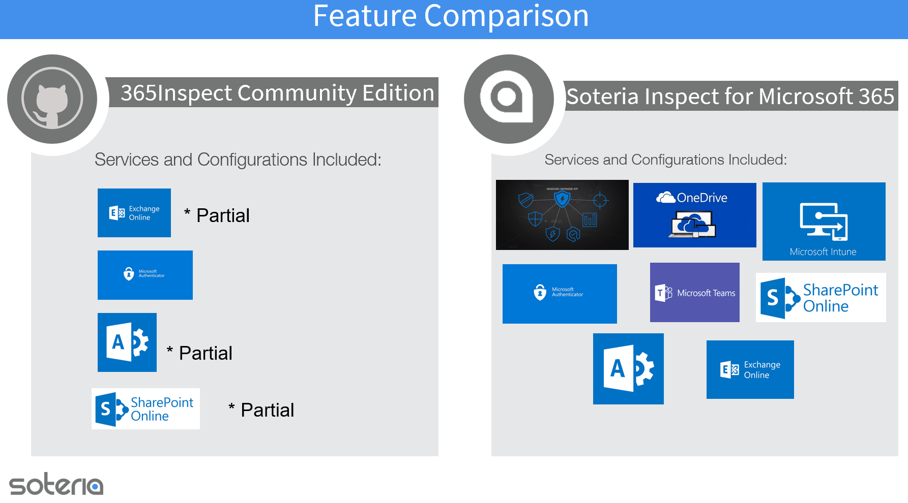
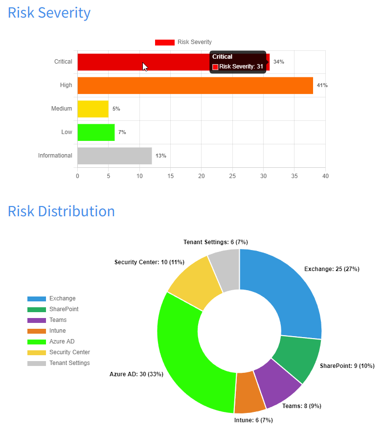
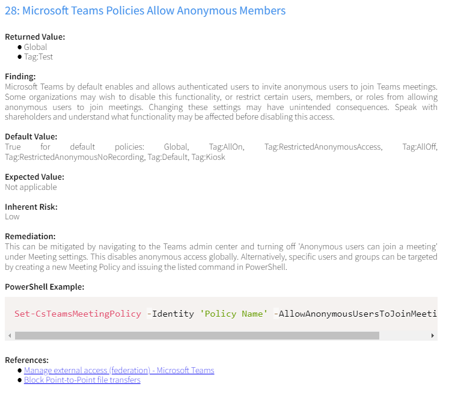
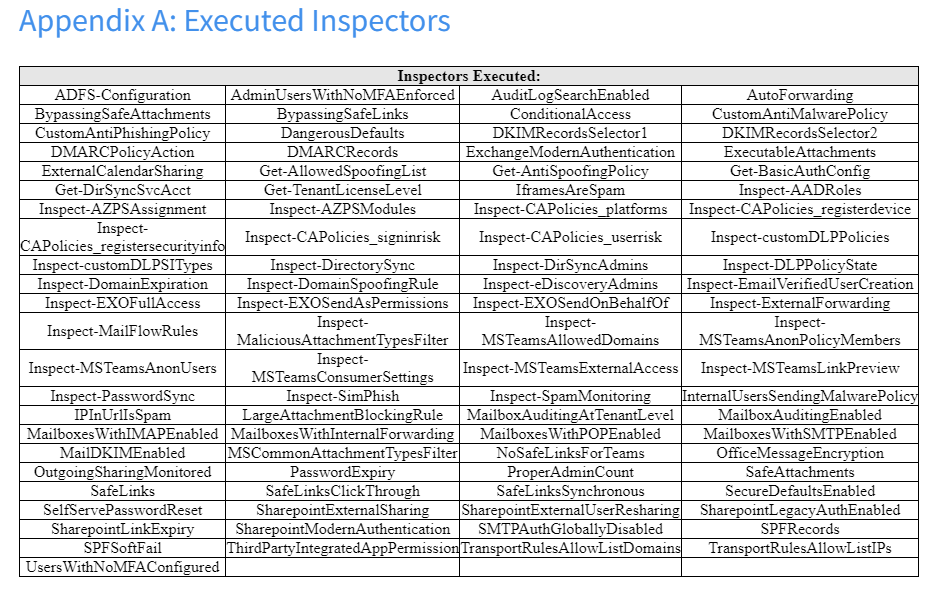

# Purpose

Further the state of Microsoft 365 security by authoring a PowerShell script that automates the security assessment of Microsoft 365 environments.

# Soteria Inspect

[Soteria Inspect](https://soteria.io/solutions/soteria-inspect/#) is born from the 365Inspect project and is Soteria's SaaS solution to aid in assessing the security of a Microsoft 365 tenant with over 200 points of inspection across the full suite of Microsoft 365 services. 

Soteria Inspect for Microsoft 365 allows customers to track changes to each finding's affected objects over time as well as remediation efforts, and now includes multi-tenancy for MSP's and parent organizations to keep a finger on the pulse of their child tenants.

Soteria Inspect for Microsoft 365 is available directly through [Soteria](https://soteria.io/solutions/soteria-inspect/#get-started) or through the [Azure Marketplace](https://azuremarketplace.microsoft.com/en-US/marketplace/apps/soteriallc1661865420827.soteria-inspect-365?ocid=GTMRewards_WhatsNewBlog_soteria-inspect-365_11172023)

<details>
<summary>See the feature comparison!</summary>



</details>

# Setup

365*Inspect* Community Edition requires the administrative PowerShell modules for Exchange administration, Microsoft Graph, Microsoft Teams, and the Sharepoint administration module.

__365*Inspect* is now compatible with PowerShell Core (6+), and requires a Microsoft Windows operating system due to required module dependencies.__

The 365*Inspect*.ps1 PowerShell script will validate the installed modules and minimum version of the modules necessary for the Inspectors to function.

If you do not have these modules installed, you will be prompted to install them, and with your approval, the script will attempt installation. Otherwise, you should be able to install them with the following commands in an administrative PowerShell prompt, or by following the instructions at the references below:

    Install-Module -Name ExchangeOnlineManagement -AllowClobber -Force
    
    # NOTE: If you are using PowerShell 5.1 you must set the MaximumVersion Parameter for PnP PowerShell 
    Install-Module -Name PnP.PowerShell -AllowClobber -MaximumVersion 1.12.0 -Force

    # NOTE: If you are using PowerShell 6.0 or higher you can install the current version of PnP PowerShell 
    Install-Module -Name PnP.PowerShell -AllowClobber -Force
    
    Install-Module -Name Microsoft.Graph -AllowClobber -Force
    
    Install-Module -Name MicrosoftTeams -AllowClobber -Force

[Install Exchange Online PowerShell](https://docs.microsoft.com/en-us/powershell/exchange/exchange-online-powershell-v2?view=exchange-ps)

[Install SharePoint PnP PowerShell Module](https://pnp.github.io/powershell/articles/installation.html)

[Install Microsoft Graph SDK](https://docs.microsoft.com/en-us/graph/powershell/installation)

[Install Microsoft Teams](https://learn.microsoft.com/en-us/microsoftteams/teams-powershell-install)

Once the above are installed, download the 365*Inspect* source code folder from Github using your browser or by using *git clone*.

As you will run 365*Inspect* with administrative privileges, you should place it in a logical location and make sure the contents of the folder are readable and writable only by the administrative user. This is especially important if you intend to install 365*Inspect* in a location where it will be executed frequently or used as part of an automated process. __NOTE:__ 365*Inspect* does not need to be run in an administrative PowerShell window to function.

# Usage

To run 365*Inspect*, open a PowerShell console and navigate to the folder you downloaded 365*Inspect* into:

	cd 365Inspect

You will interact with 365*Inspect* by executing the main script file, 365Inspect.ps1, from within the PowerShell command prompt. 

All 365*Inspect* requires to inspect your O365 tenant is access via an O365 account with proper permissions, so most of the command line parameters relate to the organization being assessed and the method of authentication. 

Execution of 365*Inspect* looks like this:

	.\365Inspect.ps1 -OutPath <value> -UserPrincipalName myuser@mytenant.onmicrosoft.com -Auth <MFA|ALREADY_AUTHED|APP>

<details>
<summary>Execution Examples</summary>
    
## Script Execution

For example, to log in by entering your credentials in a browser with MFA support:

        .\365Inspect.ps1 -OutPath ..\365_report -UserPrincipalName myuser@mytenant.onmicrosoft.com -Auth MFA


To login to a Government or other National Cloud Deployment (China, Germany, etc.) the `-Environment` parameter should be specified as follows:

        .\365Inspect.ps1 -OutPath ..\365_report -UserPrincipalName myuser@mytenant.onmicrosoft.com -Auth MFA -Environment USGovGCCHigh

Valid arguments for the `-Environment` are:
* Default - Default Microsoft 365 tenant authorization endpoints. This is the default argument if the Environment parameter is not specified.
* USGovGCCHigh - US Government GCC High tenants
* USGovDoD - US Government DoD tenants
* Germany - Microsoft 365 Azure Germany hosted tenants 
* China - Microsoft 365 China/Vianet hosted tenants

Application Authentication can be achieved by executing the script with the following parameters:

        .\365Inspect.ps1 -OutPath ..\365_report -UserPrincipalName myuser@mytenant.onmicrosoft.com -Auth APP


To login to a Government or other National Cloud Deployment (China, Germany, etc.) the `-Environment` parameter should be specified as follows:

        .\365Inspect.ps1 -OutPath ..\365_report -UserPrincipalName myuser@mytenant.onmicrosoft.com -Auth APP -Environment USGovGCCHigh

Valid arguments for the `-Environment` are:
* Default - Default Microsoft 365 tenant authorization endpoints. This is the default argument if the Environment parameter is not specified.
* USGovGCCHigh - US Government GCC High tenants
* USGovDoD - US Government DoD tenants
* Germany - Microsoft 365 Azure Germany hosted tenants 
* China - Microsoft 365 China/Vianet hosted tenants

__NOTE:__ There are prerequisites for execution of 365Inspect with application authentication. [Go to Application Authentication Requirements](#Application-Authentication-Requirements)

365*Inspect* now supports report output to HTML (default value), CSV, and XML formats.

For example, CSV reports can be generated by calling the -ReportType parameter:

        .\365Inspect.ps1 -OutPath ..\365_report -UserPrincipalName myuser@mytenant.onmicrosoft.com -Auth MFA -ReportType CSV

365*Inspect* can be run with only specified Inspector modules, or conversely, by excluding specified modules.

For example, to log in by entering your credentials in a browser with MFA support:

        .\365Inspect.ps1 -OutPath ..\365_report -UserPrincipalName myuser@mytenant.onmicrosoft.com -Auth MFA -SelectedInspectors inspector1, inspector2

or

        .\365Inspect.ps1 -OutPath ..\365_report -Auth MFA -ExcludedInspectors inspector1, inspector2, inspector3

To break down the parameters further:

* *OutPath* is the path to a folder where the report generated by 365*Inspect* will be placed.
    * Required? Yes
* *Auth* is a selector that should be one of the literal values "MFA" or "ALREADY_AUTHED". 
	* *Auth* controls how 365*Inspect* will authenticate to all of the Office 365 services. 
    <details>
    <summary>Options</summary>

	* *Auth MFA* will produce a graphical popup in which you can type your credentials and even enter an MFA code for MFA-enabled accounts. 
	* *Auth ALREADY_AUTHED* instructs 365*Inspect* not to authenticate before scanning. This may be preferable if you are executing 365*Inspect* from a PowerShell prompt where you already have valid sessions for all of the described services, such as one where you have already executed 365*Inspect*.
    * *Auth APP* instructs 365*Inspect* to prompt for Microsoft Entra ID Application Service Principal information. Required parameter variables are:
       * AppId - The application ID of the registered application
       * Certificate Thumbprint - Thumbprint of the created self-signed certificate
       * Domain - The mail domain (user@company.com or company.com) or tenant domain (company.onmicrosoft.com) of the tenant to be scanned.

    </details>
    * Required? Yes
* *SelectedInspectors* is the name or names of the inspector or inspectors you wish to run with 365*Inspect*. If multiple inspectors are selected they must be comma separated. Only the named inspectors will be run.
    * Required? No
* *ExcludedInspectors*  is the name or names of the inspector or inspectors you wish to prevent from running with 365*Inspect*. If multiple inspectors are selected they must be comma separated. All modules other included modules will be run.
    * Required? No
* *UserPrincipalName* - UserPrincipalName of the assessor, this is included to reduce the number of times you need to enter credentials in supported modules.
    * Required? Yes
* *ReportType* - Output format of the generated report. Current supported vales are HTML (default), CSV, and XML.
    * Required? No
* *Environment* - Specify the Azure Cloud instance to connect to for non-standard/consumer Microsoft 365 tenants.
    * Required? No

When you execute 365*Inspect* with *-Auth MFA*, it may produce several graphical login prompts that you must sequentially log into. This is normal behavior as Exchange, SharePoint etc. have separate administration modules and each requires a different login session. If you simply log in the requested number of times, 365*Inspect* should begin to execute. This is the opposite of fun and we're seeking a workaround, but needless to say we feel the results are worth the minute spent looking at MFA codes.

</details>

As 365*Inspect* executes, it will steadily print status updates indicating which inspection task is running.

365*Inspect* may take some time to execute. This time scales with the size and complexity of the environment under test. For example, some inspection tasks involve scanning the account configuration of all users. This may occur near-instantly for an organization with 50 users, or could take entire minutes (!) for an organization with 10000. 

# Output

365*Inspect* creates the directory specified in the out_path parameter. This directory is the result of the entire 365*Inspect* inspection. It contains four items of note:

* *Report.html*: graphical report that describes the O365 security issues identified by 365*Inspect*, lists O365 objects that are misconfigured, and provides remediation advice.
* *Various text files named [Inspector-Name]*: these are raw output from inspector modules and contain a list (one item per line) of misconfigured O365 objects that contain the described security flaw. For example, if a module Inspect-FictionalMFASettings were to detect all users who do not have MFA set up, the file "Inspect-FictionalMFASettings" in the report ZIP would contain one user per line who does not have MFA set up. This information is only dumped to a file in cases where more than 15 affected objects are discovered. If less than 15 affected objects are discovered, the objects are listed directly in the main HTML report body.
* *Report.zip*: zipped version of this entire directory, for convenient distribution of the results in cases where some inspector modules generated a large amount of findings.
* *Log directory*: 365*Inspect* logs any errors encountered during the scripts execution to a timestamped log file found in the Log directory

### CSV Output

Due to the nature of some of the returned items, the csv report is delimited on the carat (^) character. 
It is recommended to open the CSV report in a text editor rather than Excel, as Excel defaults to a comma (,) delimiter and will render the report incorrectly.
Once opened in a text editor, the data may be pasted into Excel.

# Coming Soon!

* [You tell us!](https://github.com/soteria-security/365Inspect/issues/new?assignees=&labels=&projects=&template=feature_request.md&title=) 

# Change Log

* Support for [National Cloud Deployments](https://learn.microsoft.com/en-us/graph/deployments)

<details>
<summary>Older Changes</summary>

## Older Changes

* 365*Inspect* now supports Application Authentication

* 365*Inspect*'s HTML report format has changed
    * Include new visual indicators of risk in the form of two charts
        
    * Separated the PowerShell commands from the remediation steps and added syntax highlighting
        
    * Moved the list of Inspectors executed to an appendix at the bottom of the report
        

</details>

# Necessary Privileges

365*Inspect* can't run properly unless the O365 account you authenticate with has appropriate privileges. 365*Inspect* requires, at minimum, the following:

* Global Administrator
* SharePoint Administrator

We realize that these are extremely permissive roles, unfortunately due to the use of Microsoft Graph, we are restricted from using lesser privileges by Microsoft. Application and Cloud Application Administrator roles (used to grant delegated and application permissions) are restricted from granting permissions for Microsoft Graph or Azure AD PowerShell modules. [Microsoft Docs - Application Administrator](https://docs.microsoft.com/en-us/azure/active-directory/roles/permissions-reference#application-administrator) 

If executing 365*Inspect* using the application auth parameter, additional roles must be granted to allow the application to perform all executed tasks. See [Application Authentication requirements](#application-authentication-requirements)

# Application Authentication Requirements

Before 365*Inspect* can be utilized all other requisite components must be in place.
<details>
<summary>Prerequisite Preparation</summary>

For the most efficient use of time, it is recommended to perform the requisite functions in the following order:
1. Prepare the client machine
   1. Client machine __MUST__ be a Microsoft Windows OS
   1. Install required PowerShell modules listed in the [Setup](#setup) section above.
   1. Ensure proper access controls are in place
1. Create the necessary certificate
   1. Create self-signed certificate for Azure Application authentication
1. Create Azure Application
   1. Create the Service Principal
   1. Assign necessary rights to the application [API permissions](#Required-Permissions)
   1. Assign the required roles to the application's Service Principal
      1. Global Administrator
      1. Exchange Administrator
      1. Teams Administrator
      1. SharePoint Administrator
   1. Upload certificate
   1. Document required information
1. Acquire 365Inspect tool
   1. Download and extract the tool to the desired location on the client

</details>

See the following references:
* [Tutorial: Register an app with Microsoft Entra ID](https://learn.microsoft.com/en-us/power-apps/developer/data-platform/walkthrough-register-app-azure-active-directory)
* [App-only authentication for unattended scripts in Exchange Online PowerShell and Security & Compliance PowerShell](https://docs.microsoft.com/en-us/powershell/exchange/app-only-auth-powershell-v2)
* [Application and service principal objects in Microsoft Entra ID](https://learn.microsoft.com/en-us/entra/identity-platform/app-objects-and-service-principals?tabs=browser)

## Required Permissions
<details>
<summary>Expand</summary>
	
## Required Permissions
* User.Read.All
* Calendars.Read
* Mail.Read
* Contacts.Read
* TeamMember.Read.All
* Place.Read.All
* Chat.UpdatePolicyViolation.All
* Policy.Read.ConditionalAccess
* AppCatalog.Read.All
* TeamsAppInstallation.ReadForUser.All
* eDiscovery.Read.All
* UserShiftPreferences.Read.All
* CustomSecAttributeDefinition.Read.All
* AgreementAcceptance.Read.All
* ExternalConnection.Read.All
* EduRoster.Read.All
* ServicePrincipalEndpoint.Read.All
* CloudPC.Read.All
* DeviceManagementManagedDevices.Read.All
* OnlineMeetings.Read.All
* Device.Read.All
* TeamsTab.Read.All
* DelegatedAdminRelationship.Read.All
* UserAuthenticationMethod.Read.All
* TeamsActivity.Read.All
* Printer.Read.All
* OrgContact.Read.All
* TeamsAppInstallation.ReadForChat.All
* Policy.Read.PermissionGrant
* OnlineMeetingArtifact.Read.All
* SharePointTenantSettings.Read.All
* ChannelSettings.Read.All
* SecurityEvents.Read.All
* DelegatedPermissionGrant.ReadWrite.All
* OnlineMeetingRecording.Read.All
* IdentityRiskyServicePrincipal.Read.All
* CrossTenantUserProfileSharing.Read.All
* Calendars.Read
* Mail.ReadBasic.All
* PrivilegedAccess.Read.AzureAD
* RoleManagement.Read.Directory
* Channel.ReadBasic.All
* People.Read.All
* SecurityAlert.Read.All
* Group.Read.All
* AdministrativeUnit.Read.All
* MailboxSettings.Read
* CrossTenantInformation.ReadBasic.All
* EduAdministration.Read.All
* Sites.Read.All
* PrintJob.Read.All
* DeviceManagementServiceConfig.Read.All
* ServiceMessage.Read.All
* PrintSettings.Read.All
* DirectoryRecommendations.Read.All
* Notes.Read.All
* EntitlementManagement.Read.All
* CallRecords.Read.All
* IdentityUserFlow.Read.All
* ChatMessage.Read.All
* Directory.Read.All
* ConsentRequest.Read.All
* RoleManagement.Read.All
* CallRecord*PstnCalls.Read.All
* PrivilegedAccess.Read.AzureResources
* User.Read.All
* Domain.Read.All
* EduAssignments.ReadBasic.All
* EduRoster.ReadBasic.All
* Agreement.Read.All
* OnlineMeetingTranscript.Read.All
* ChannelMember.Read.All
* Schedule.Read.All
* SecurityIncident.Read.All
* GroupMember.Read.All
* DeviceManagementRBAC.Read.All
* RoleManagement.Read.CloudPC
* Files.Read.All
* CustomSecAttributeAssignment.Read.All
* SearchConfiguration.Read.All
* DeviceManagementConfiguration.Read.All
* Team.ReadBasic.All
* APIConnectors.Read.All
* Mail.Read
* Chat.Read.All
* ExternalItem.Read.All
* ChannelMessage.Read.All
* EduAssignments.Read.All
* SecurityActions.Read.All
* ThreatAssessment.Read.All
* IdentityProvider.Read.All
* TeamSettings.Read.All
* IdentityRiskyUser.Read.All
* AccessReview.Read.All
* LicenseAssignment.ReadWrite.All
* TermStore.Read.All
* TeamworkTag.Read.All
* PrivilegedAccess.Read.AzureADGroup
* InformationProtectionPolicy.Read.All
* Organization.Read.All
* Contacts.Read
* IdentityRiskEvent.Read.All
* Mail.ReadBasic
* AuditLog.Read.All
* Policy.Read.All
* Policy.ReadWrite.CrossTenantAccess
* Member.Read.Hidden
* Chat.ReadBasic.All
* Application.Read.All
* ProgramControl.Read.All
* ServiceHealth.Read.All
* ChatMember.Read.All
* DeviceManagementApps.Read.All
* ThreatIndicators.Read.All
* TeamsAppInstallation.ReadForTeam.All
* ShortNotes.Read.All
* Reports.Read.All
* PrintJob.ReadBasic.All
* TrustFrameworkKeySet.Read.All
* ThreatHunting.Read.All
* TeamworkDevice.Read.All
* Synchronization.Read.All
* AuthenticationContext.Read.All
* CustomAuthenticationExtension.Read.All
* ThreatSubmission.Read.All
* LifecycleWorkflows.Read.All
* ReportSettings.Read.All
* RecordsManagement.Read.All
* RoleManagementAlert.Read.Directory
  
</details>

# Developing Inspector Modules

365*Inspect* is designed to be easy to expand, with the hope that it enables individuals and organizations to either utilize their own 365*Inspect* modules internally, or publish those modules for the O365 community.

All of 365*Inspect*'s inspector modules are stored in the .\inspectors folder. 

It is simple to create an inspector module. Inspectors have two files:

* *ModuleName.ps1*: the PowerShell source code of the inspector module. Should return a list of all O365 objects affected by a specific issue, represented as strings.
* *ModuleName.json*: metadata about the inspector itself. For example, the finding name, description, remediation information, and references.

Templates are included in the Templates folder. Simply add your code and values in the respective locations.
The PowerShell and JSON file names must be identical for 365*Inspect* to recognize that the two belong together. There are numerous examples in 365*Inspect*'s built-in suite of modules, but we'll put an example here too.

<details>
<summary>Example .ps1 file, BypassingSafeAttachments.ps1:</summary>

```powershell
# Define a function that we will later invoke.
# 365Inspect's built-in modules all follow this pattern.
function Inspect-BypassingSafeAttachments {
	# Query some element of the O365 environment to inspect. Note that we did not have to authenticate to Exchange
	# to fetch these transport rules within this module; assume main 365Inspect harness has logged us in already.
	$safe_attachment_bypass_rules = (Get-TransportRule | Where { $_.SetHeaderName -eq "X-MS-Exchange-Organization-SkipSafeAttachmentProcessing" }).Identity
	
	# If some of the parsed O365 objects were found to have the security flaw this module is inspecting for,
	# return a list of strings representing those objects. This is what will end up as the "Affected Objects"
	# field in the report.
	If ($safe_attachment_bypass_rules.Count -ne 0) {
		return $safe_attachment_bypass_rules
	}
	
	# If none of the parsed O365 objects were found to have the security flaw this module is inspecting for,
	# returning $null indicates to 365Inspect that there were no findings for this module.
	return $null
}

# Return the results of invoking the inspector function.
return Inspect-BypassingSafeAttachments
```

</details>

<details>
<summary>Example .json file, BypassingSafeAttachments.json:</summary>

```json
{
    "FindingName": "Do Not Bypass the Safe Attachments Filter",
    "Description": "In Exchange, it is possible to create mail transport rules that bypass the Safe Attachments detection capability. The rules listed above bypass the Safe Attachments capability. Consider reviewing these rules, as bypassing the Safe Attachments capability even for a subset of senders could be considered insecure depending on the context or may be an indicator of compromise.",
    "Remediation": "Navigate to the Mail Flow &rarr; Rules screen in the Exchange Admin Center. Look for the offending rules and begin the process of assessing who created them and whether they are necessary to the continued function of the organization. If they are not, remove the rules.",
    "DefaultValue": "None",
    "ExpectedValue": "None",
    "Impact": "Critical",
    "AffectedObjects": "",
    "Service": "Exchange",  // Valid values are Exchange, SharePoint, Teams, Intune, AzureAD, SecurityandCompliance, Tenant //
    "PowerShell": "", // Any PowerShell remediation command examples should be placed here //
    "References": [
        {
            "Url": "https://docs.microsoft.com/en-us/exchange/security-and-compliance/mail-flow-rules/manage-mail-flow-rules",
            "Text": "Manage Mail Flow Rules in Exchange Online"
        },
        {
            "Url": "https://www.undocumented-features.com/2018/05/10/atp-safe-attachments-safe-links-and-anti-phishing-policies-or-all-the-policies-you-can-shake-a-stick-at/#Bypass_Safe_Attachments_Processing",
            "Text": "Undocumented Features: Safe Attachments, Safe Links, and Anti-Phishing Policies"
        }
    ]
}
```

</details>

Once you drop these two files in the .\inspectors folder, they are considered part of 365*Inspect*'s module inventory and will run the next time you execute 365*Inspect*.

You have just created the BypassingSafeAttachments Inspector module. That's all!

365*Inspect* will throw a pretty loud and ugly error if something in your module doesn't work or doesn't follow 365*Inspect* conventions, so monitor the command line output.

# Contributing
We encourage community involvement and contributions!
Please check out our [Contributing Guidelines](.github/ISSUE_TEMPLATE/CONTRIBUTING.md)

# About Security

365*Inspect* is a script harness that runs other inspector script modules stored in the .\inspectors folder. As with any other script you may run with elevated privileges, you should observe certain security hygiene practices:

* No untrusted user should have write access to the 365*Inspect* folder/files, as that user could then overwrite scripts or templates therein and induce you to run malicious code.
* No script module should be placed in .\inspectors unless you trust the source of that script module.

# About Soteria

Soteria offers a wide range of security and advisory solutions including Incident Response, Managed Detection and Response, Security Assessments, Penetration Testing, and more. Contact us for all your needs!